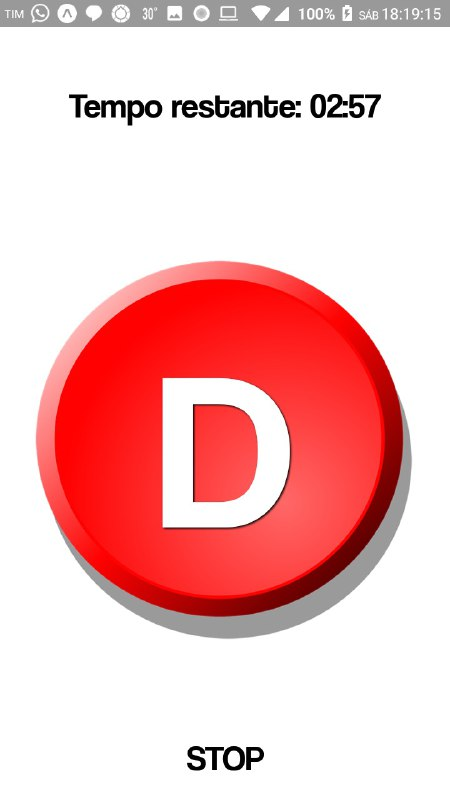

<p align="center">



</p><br />

# stop

# Developing

```sh
$ git clone https://github.com/matAlmeida/stop
$ cd stop
$ npm i -g expo-cli
$ npm i
$ npm start #Or you can run: expo start
```

# Deploy

```sh
$ expo build:android
$ adb install <colorbattle-*>.apk
```
